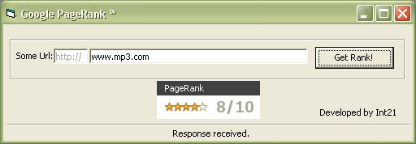



## Google PageRank&\#8482;

### Description

Now you can know what's the pagerank for any webpage.

PageRank Explain:

PageRank is a numeric value that represents how important a page is on the web. Google figures that when one page links to another page, it is effectively casting a vote for the other page. The more votes that are cast for a page, the more important the page must be. Also, the importance of the page that is casting the vote determines how important the vote itself is. Google calculates a page's importance from the votes cast for it. How important each vote is is taken into account when a page's PageRank is calculated.

PageRank is Google's way of deciding a page's importance. It matters because it is one of the factors that determines a page's ranking in the search results. It isn't the only factor that Google uses to rank pages, but it is an important one.
 
### More Info
 
URL's page

Page rank

             |
---                |---
**Submitted On**   |2005-11-07 12:40:12
**By**             |[Int\_21](https://github.com/Planet-Source-Code/PSCIndex/blob/master/ByAuthor/int-21.md)
**Level**          |Advanced
**User Rating**    |5.0 (50 globes from 10 users)
**Compatibility**  |VB 6\.0
**Category**       |[Internet/ HTML](https://github.com/Planet-Source-Code/PSCIndex/blob/master/ByCategory/internet-html__1-34.md)
**World**          |[Visual Basic](https://github.com/Planet-Source-Code/PSCIndex/blob/master/ByWorld/visual-basic.md)
**Archive File**   |[Google\_Pag1946771172005\.zip](https://github.com/Planet-Source-Code/int-21-google-pagerank-8482__1-63194/archive/master.zip)

